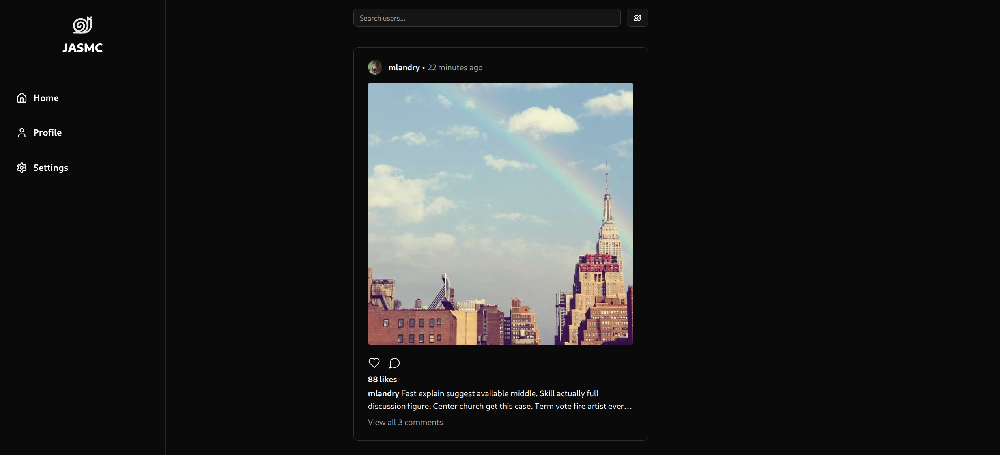
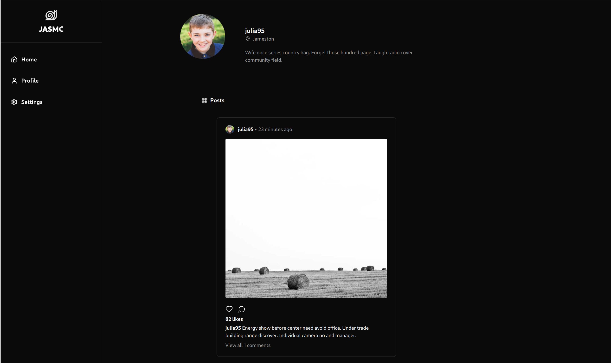

# JASMC (Just Another Social Media Clone)

## Frontend 📷




## Testing Locally

### Running Frontend

In `/frontend`

```bash
npm run dev
```

Serving on `http://localhost:5173/`.

### Running Backend

In `/backend`

```bash
docker compose up --build
```

## Testing Cluster Locally with Minikube

In `/`

```bash
minikube start && \
eval $(minikube docker-env) && \
docker build -t jasmc-frontend-image:latest ./frontend --no-cache && \
docker build -t jasmc-backend-image:latest ./backend --no-cache && \
kubectl apply -f ./k8s && \
xdg-open http://$(minikube ip)
```
